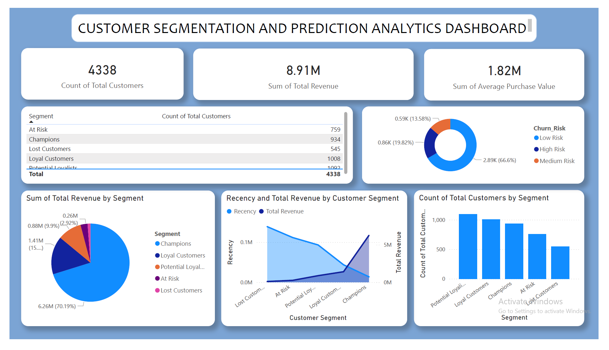
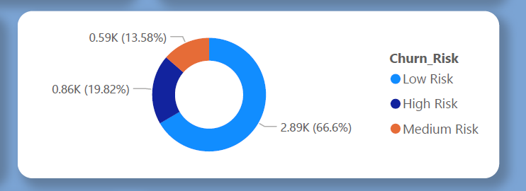

# Customer Segmentation & Churn Prediction Dashboard

A comprehensive Power BI dashboard analyzing customer behavior, segmentation patterns, and churn prediction to support data-driven business decisions and improve customer retention strategies.

## 🎯 Business Problem

Customer churn is a critical challenge for businesses because acquiring new customers is significantly more expensive than retaining existing ones.  
This dashboard addresses the need to:
- Identify customers at risk of churning before they leave
- Understand which customer segments generate the most revenue
- Enable proactive retention strategies through data-driven insights

## 📊 Dashboard Overview

This interactive dashboard provides insights into customer segmentation and churn patterns, featuring:
- Total customer count and distribution across segments
- Revenue analysis by customer segments
- Churn risk assessment by customer categories
- Customer segment distribution visualizations

### Key Metrics

- **Total Customers**: 4,338  
- **Customer Segments**: At Risk, Champions, Lost Customers, Loyal Customers, Potential Loyalists  
- **Risk Categories**: Low Risk, Medium Risk, High Risk  
- **Revenue Tracking**: Total revenue breakdown by segment (8.91M)

## 📸 Dashboard Preview

  
*Main dashboard showing customer segmentation and revenue breakdown*

  
*Churn risk assessment by customer segment*

## 🎯 Features

- **Customer Segmentation Analysis**: Categorizes customers into distinct segments based on behavior and value
- **Churn Risk Prediction**: Identifies customers at risk of churning with risk level classification
- **Revenue Distribution**: Visual breakdown of total revenue contribution by each customer segment
- **Interactive Filtering**: Dynamic exploration of customer data across multiple dimensions

## 🛠️ Technologies Used

- **Microsoft Power BI Desktop**: Primary dashboard development tool
- **Data Analysis Expressions (DAX)**: Custom measures and calculated columns
- **Data Modeling**: Relational data structure for efficient analysis

## 📁 Project Structure

- **README.md** - Project documentation
- **CustomerSegmentation.pbix** - Power BI dashboard file
- **Data/** - Source datasets
  - OnlineRetail.csv
  - rfm_results.csv
  - rfm_with_predictions.csv
- **screenshots/** - Dashboard images
  - dashboard_overview.png
  - churn_risk.png
- **visualizations/** - Analysis charts
- **RFM_Analysis.ipynb** - Jupyter notebook for RFM analysis

## 🚀 Getting Started

### Prerequisites

- Microsoft Power BI Desktop (latest version)
- Microsoft 365 work or school account (required for publishing to Power BI Service)

### Installation

1. Clone this repository

2. Open the CustomerSegmentation.pbix file in Power BI Desktop

3. Refresh data connections if using external data sources

## 📈 Dashboard Components

### 1. Customer Count Card
Displays the total number of customers in the dataset (4,338)

### 2. Segment Distribution Table
Lists customer counts for each segment:
- At Risk
- Champions
- Lost Customers
- Loyal Customers
- Potential Loyalists

### 3. Revenue by Segment
Visual representation showing:
- Champions: 6.26M (70.19%)
- Loyal Customers: Revenue contribution
- Potential Loyalists: Revenue share
- At Risk: Revenue analysis
- Lost Customers: Revenue tracking

### 4. Churn Risk Analysis
Risk categorization by customer segment:
- Low Risk
- Medium Risk
- High Risk

### 5. Customer Segment Distribution
Bar chart showing customer distribution across identified segments

## 📊 Data Sources

The dashboard analyzes customer data including:
- Customer demographic information
- Transaction history
- Purchase patterns
- Engagement metrics
- Customer lifecycle data

**Dataset Details:**
- **Source**: Synthetic dataset created for learning purposes
- **Size**: 4,338 customer records
- **Key Fields**: CustomerID, Segment, Revenue, LastPurchaseDate, ChurnFlag

## 🔍 Key Insights

This dashboard enables stakeholders to:
- Identify high-value customer segments for targeted marketing campaigns
- Predict and prevent customer churn proactively
- Optimize resource allocation based on segment profitability
- Track customer retention metrics over time
- Make data-driven decisions for customer engagement strategies

## 🔄 Future Enhancements

- [ ] Add time-series analysis for trend identification
- [ ] Implement predictive churn modeling with machine learning
- [ ] Include customer lifetime value (CLV) calculations
- [ ] Add real-time data refresh capabilities
- [ ] Create drill-through pages for detailed segment analysis

## 💡 Challenges & Learnings

- **Challenge**: Defining meaningful customer segments from raw transactional data
  - **Approach**: Used RFM (Recency, Frequency, Monetary) logic to create data-driven segments

- **Challenge**: Balancing dashboard complexity with usability
  - **Approach**: Built a single-page overview with supporting visuals instead of overcrowding with too many charts

## 👨‍💻 Author

**Harini Janga**  
- GitHub: [@HariniJanga](https://github.com/HariniJanga)  
- LinkedIn: [Harini Janga](https://www.linkedin.com/in/harini-janga-210166236)  
- Email: harinijanga04@gmail.com

## 📝 License

This project is licensed under the MIT License - see the LICENSE file for details.

---

**Note**: This dashboard is designed for learning and portfolio purposes. It demonstrates end-to-end skills in data modeling, DAX calculations, and Power BI dashboard design focused on customer analytics and churn prediction.
